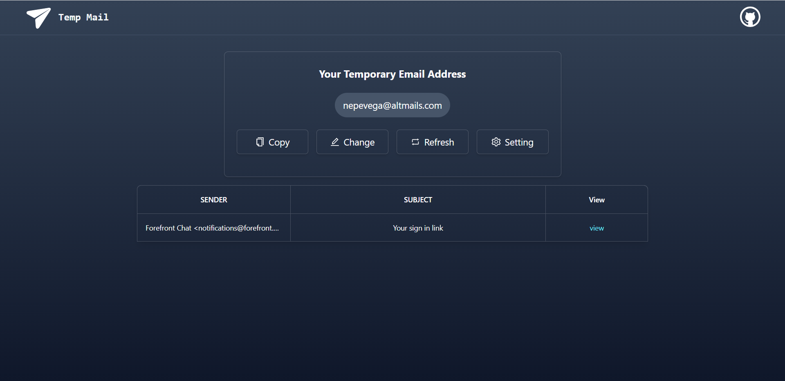
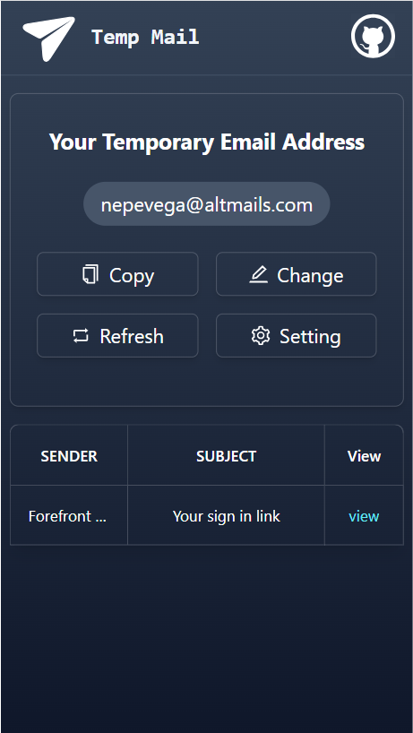

<h1 align="center">Temp Mail</h1>

一键免费部署你的私人 Temp Mail 临时邮箱网页应用。

## Features
- **Deploy for free with one-click** on Vercel in under 1 minute
- Unlimited number of mailboxes, safe and reliable
- Adapted to the mobile terminal and PC terminal, the access is more convenient

## 主要功能
- 在 1 分钟内使用 Vercel **免费一键部署**
- 不限制邮箱数量，安全、可靠
- 适配了手机端、PC端，访问更便捷
- 拥有自己的域名？好上加好，绑定后即可在任何地方**无障碍**快速访问

## Get Started
1. Click the button on the right to start deployment， ，Just log in directly with your Github account.
2. Once deployed, you can start using.

## 开始使用

1. 点击右侧按钮开始部署：
   ，直接使用 Github 账号登录即可；
2. 部署完毕后，即可开始使用；
3. （可选）[绑定自定义域名](https://vercel.com/docs/concepts/projects/domains/add-a-domain)：Vercel 分配的域名 DNS 在某些区域被污染了，绑定自定义域名即可直连。

## Keep Updated
If you follow the above steps to deploy your own project with one click, you may find that you always prompt "There is an update", this is because Vercel will create a new project for you by default instead of forking this project, which will prevent you from detecting updates correctly.
It is recommended that you follow these steps to redeploy:

- Delete the original warehouse;
- Use the fork button in the upper right corner of the page to fork this project;
- Re-select and deploy in Vercel

## 保持更新

如果你按照上述步骤一键部署了自己的项目，可能会发现总是提示“存在更新”的问题，这是由于 Vercel 会默认为你创建一个新项目而不是 fork 本项目，这会导致无法正确地检测更新。
推荐你按照下列步骤重新部署：

- 删除掉原先的仓库；
- 使用页面右上角的 fork 按钮，fork 本项目；
- 在 Vercel 重新选择并部署

